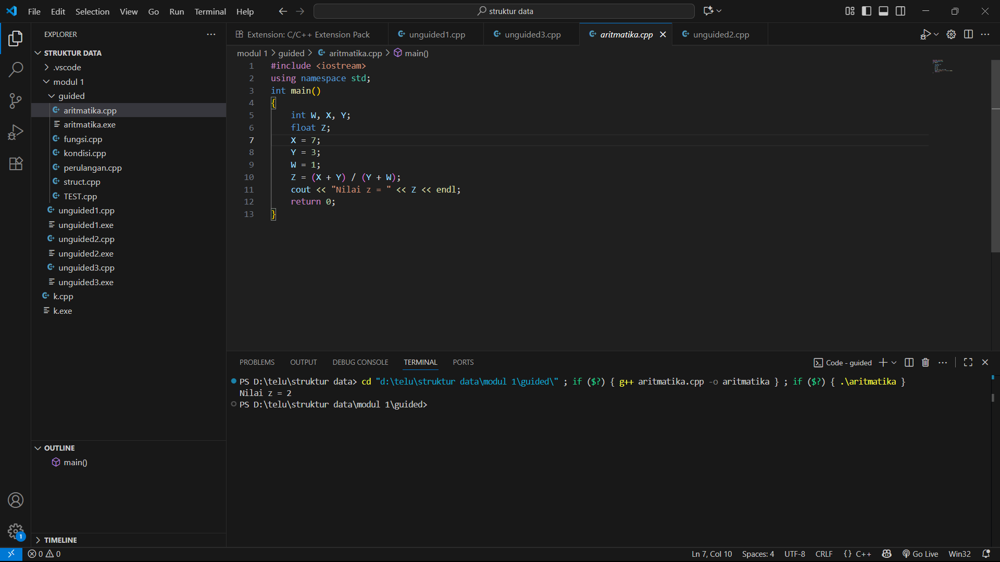
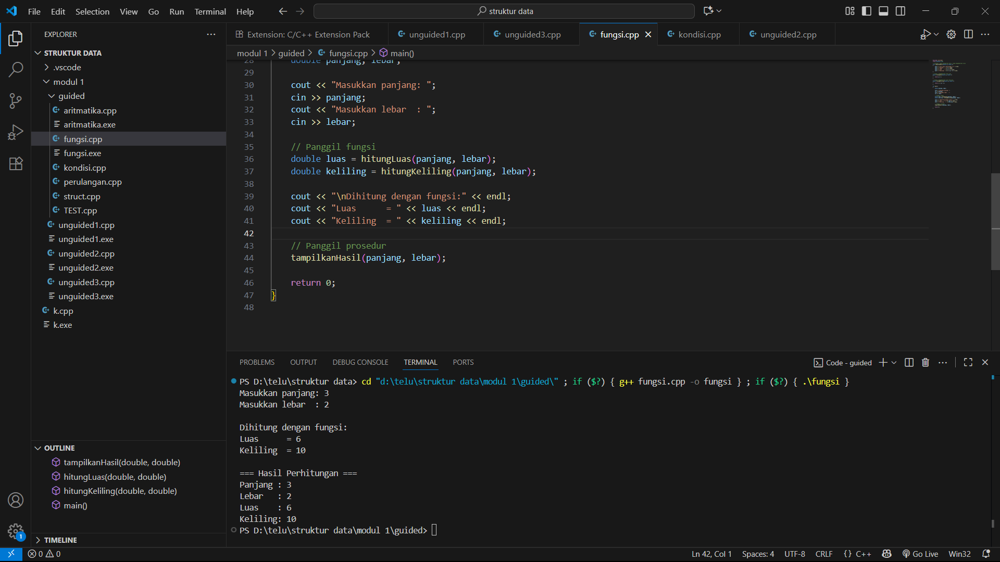
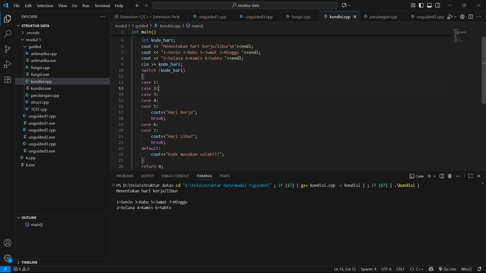
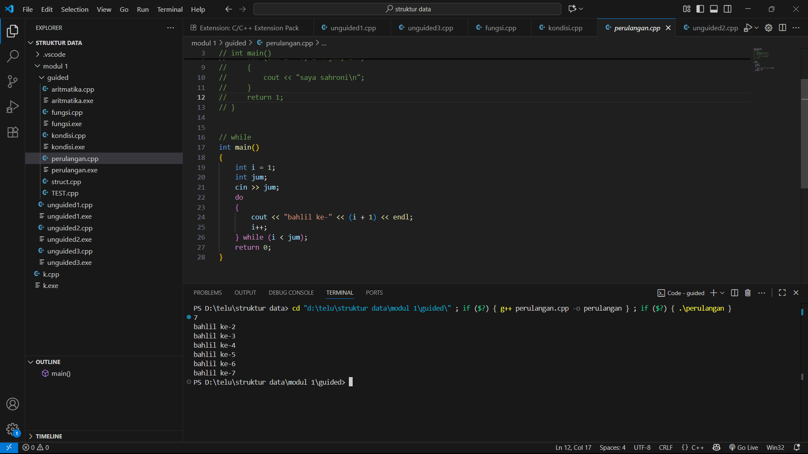
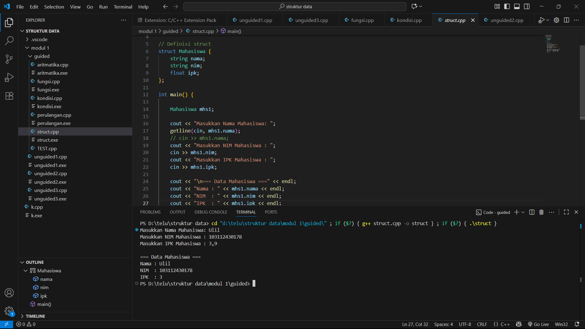
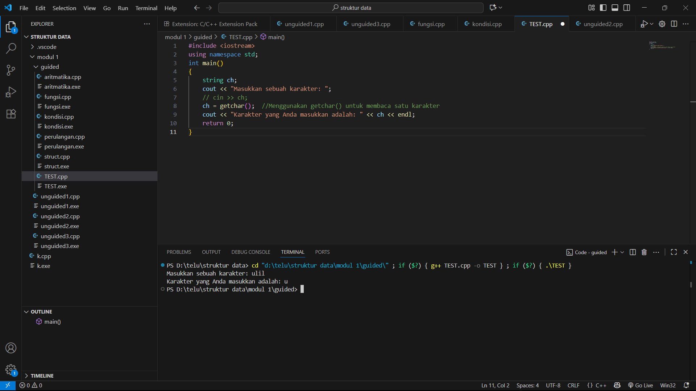
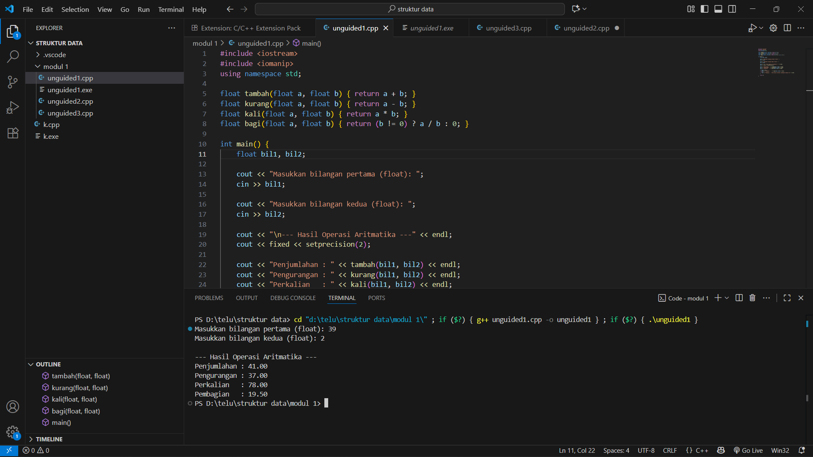
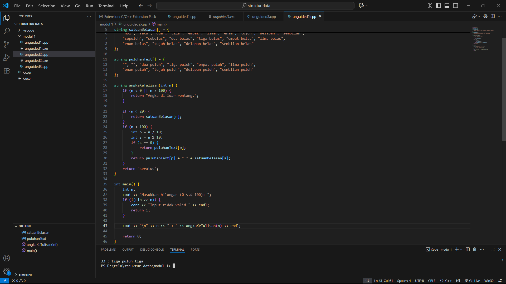
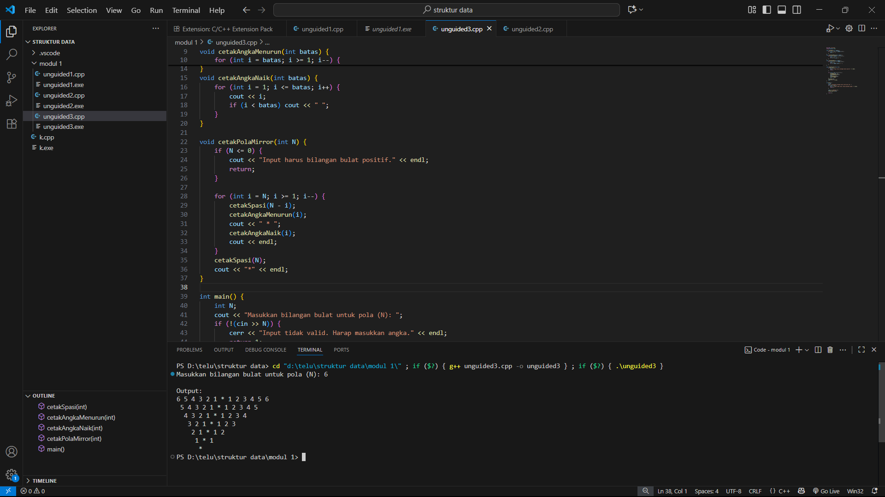

# <h1 align="center">Laporan Praktikum Modul 1 <br> PENGENALAN C++ </h1>
<p align="center">ULIL FAHMI NURWIDYA - 103112430178</p>

## Dasar Teori

C++ merupakan bahasa pemrograman yang dikembangkan oleh Bjarne Stroustrup pada awal tahun 1980-an pada Bell Laboratories. C++ merupakan pengembangan dari bahasa C menggunakan penambahan konsep pemrograman berorientasi objek (Object-Oriented Programming / OOP), sehingga dapat digunakan untuk membangun perangkat lunak dari skala kecil hingga besar dengan lebih efisien.C++ tetap menjadi salah satu bahasa pemrograman penting yang digunakan untuk pengembangan berbagai jenis perangkat lunak sampai saat ini.
## Guided

### soal 1 (aritmatika)
```c++
#include <iostream>
using namespace std;
int main()
{
    int W, X, Y;
    float Z;
    X = 7;
    Y = 3;
    W = 1;
    Z = (X + Y) / (Y + W);
    cout << "Nilai z = " << Z << endl;
    return 0;
}
```
> Output
> 
Program tersebut menyediakan beberapa variabel bilangan bulat (W, X, Y) dan satu variabel bilangan desimal (Z). Setelah itu, program memberikan nilai awal pada variabel X = 7, Y = 3, dan W = 1. Selanjutnya, program menghitung nilai Z menggunakan rumus (X + Y) / (Y + W). Karena Z adalah tipe data float, maka hasil dari operasi pembagian akan disimpan dalam bentuk desimal.
Supaya hasil lebih jelas, program menampilkan nilai Z ke layar menggunakan cout. Dengan cara ini, program memperlihatkan bagaimana operasi aritmatika sederhana dapat dijalankan dengan kombinasi tipe data integer dan float. Struktur program juga sederhana sehingga mudah dipahami, sekaligus menunjukkan konsep dasar deklarasi variabel, pemberian nilai, operasi aritmatika, dan output dalam C++.
### soal 2 (fungsi)
```c++
#include <iostream>
using namespace std;

// Prosedur: hanya menampilkan hasil, tidak mengembalikan nilai
void tampilkanHasil(double p, double l)
{
    cout << "\n=== Hasil Perhitungan ===" << endl;
    cout << "Panjang : " << p << endl;
    cout << "Lebar   : " << l << endl;
    cout << "Luas    : " << p * l << endl;
    cout << "Keliling: " << 2 * (p + l) << endl;
}

// Fungsi: mengembalikan nilai luas
double hitungLuas(double p, double l)
{
    return p * l;
}

// Fungsi: mengembalikan nilai keliling
double hitungKeliling(double p, double l)
{
    return 2 * (p + l);
}

int main()
{
    double panjang, lebar;

    cout << "Masukkan panjang: ";
    cin >> panjang;
    cout << "Masukkan lebar  : ";
    cin >> lebar;

    // Panggil fungsi
    double luas = hitungLuas(panjang, lebar);
    double keliling = hitungKeliling(panjang, lebar);

    cout << "\nDihitung dengan fungsi:" << endl;
    cout << "Luas      = " << luas << endl;
    cout << "Keliling  = " << keliling << endl;

    // Panggil prosedur
    tampilkanHasil(panjang, lebar);

    return 0;
}
```
> Output
> 
Program tersebut digunakan buat menghitung luas dan keliling persegi panjang berdasarkan input panjang dan lebar dari pengguna. Perhitungan dilakukan dengan dua cara, yaitu melalui fungsi (hitungLuas dan hitungKeliling) yang mengembalikan nilai hasil perhitungan, serta prosedur (tampilkanHasil) yang langsung menampilkan panjang, lebar, luas, dan keliling ke layar. Dengan pendekatan ini, program memperlihatkan perbedaan penggunaan fungsi dan prosedur dalam C++, sekaligus membuat kode lebih rapi, terstruktur, dan mudah dipahami.
### soal 3 (kondisi)
```c++
#include <iostream>
using namespace std;
int main()
{
    int kode_hari;
    cout << "Menentukan hari kerja/libur\n"<<endl;
    cout << "1=Senin 3=Rabu 5=Jumat 7=Minggu "<<endl;
    cout << "2=Selasa 4=Kamis 6=Sabtu "<<endl;
    cin >> kode_hari;
    switch (kode_hari)
    {
    case 1:
    case 2:
    case 3:
    case 4:
    case 5:
        cout<<"Hari Kerja";
        break;
    case 6:
    case 7:
        cout<<"Hari Libur";
        break;
    default:
        cout<<"Kode masukan salah!!!";
    }
    return 0;
}
```
> Output
> 
Program tersebut digunakan untuk menentukan apakah sebuah hari termasuk hari kerja atau hari libur berdasarkan kode angka yang dimasukkan pengguna. Kode hari ditentukan dengan angka 1 sampai 7, di mana 1=Senin, 2=Selasa, 3=Rabu, 4=Kamis, 5=Jumat, 6=Sabtu, dan 7=Minggu. Program menggunakan struktur switch-case untuk mengecek input: jika kode 1–5 maka ditampilkan “Hari Kerja”, jika kode 6 atau 7 ditampilkan “Hari Libur”, sedangkan jika input tidak sesuai rentang 1–7 maka muncul pesan “Kode masukan salah!!!”. Dengan cara ini, program memberikan gambaran sederhana bagaimana logika percabangan switch-case bekerja dalam menentukan kategori berdasarkan input angka.
### soal 4 (perulangan)
```c++
#include <iostream>
using namespace std;
// int main()
// {
//     int jum;
//     cout << "jumlah perulangan: ";
//     cin >> jum;
//     for (int i = 0; i < jum; i++)
//     {
//         cout << "saya sahroni\n";
//     }
//     return 1;
// }


// while
int main()
{
    int i = 1;
    int jum;
    cin >> jum;
    do
    {
        cout << "bahlil ke-" << (i + 1) << endl;
        i++;
    } while (i < jum);
    return 0;
}
```
> Output
> 
Program tersebut digunakan buat menampilkan teks berulang sesuai jumlah yang dimasukkan pengguna. Pertama, user diminta menginput nilai jum sebagai batas perulangan. Program menggunakan struktur perulangan do-while, di mana perintah cout akan dijalankan minimal sekali lalu terus berulang selama nilai i masih lebih kecil dari jum. Setiap perulangan, variabel i bertambah 1 dan teks yang ditampilkan berupa “bahlil ke-” diikuti dengan urutan ke-berapa (dihitung dari i+1). Dengan cara ini, program menunjukkan bagaimana perulangan do-while bekerja, yaitu selalu menjalankan isi perulangan setidaknya sekali meskipun kondisi akhirnya tidak terpenuhi.
### soal 5 (struct)
```c++
#include <iostream>
#include <string>
using namespace std;

// Definisi struct
struct Mahasiswa {
    string nama;
    string nim;
    float ipk;
};

int main() {

    Mahasiswa mhs1;

    cout << "Masukkan Nama Mahasiswa: ";
    getline(cin, mhs1.nama);
    // cin >> mhs1.nama;
    cout << "Masukkan NIM Mahasiswa : ";
    cin >> mhs1.nim;
    cout << "Masukkan IPK Mahasiswa : ";
    cin >> mhs1.ipk;

    cout << "\n=== Data Mahasiswa ===" << endl;
    cout << "Nama : " << mhs1.nama << endl;
    cout << "NIM  : " << mhs1.nim << endl;
    cout << "IPK  : " << mhs1.ipk << endl;

    return 0;
}

```
> Output
> 
Program ini mendemonstrasikan penggunaan struct di C++ untuk menyimpan data mahasiswa. Struct Mahasiswa didefinisikan dengan tiga atribut: nama, nim, dan ipk. Di dalam main(), dibuat sebuah objek mhs1 dari struct tersebut. Program kemudian meminta pengguna untuk mengisi data berupa nama (menggunakan getline agar bisa membaca nama lengkap dengan spasi), NIM, dan IPK. Setelah data dimasukkan, program menampilkan kembali hasil input dalam format rapi di bawah judul Data Mahasiswa. Intinya, program ini menunjukkan bagaimana struct bisa dipakai untuk mengelompokkan beberapa data berbeda tapi masih dalam satu entitas (dalam hal ini, mahasiswa).
### soal 6 (test)
```c++
#include <iostream>
using namespace std;
int main()
{
    string ch;
    cout << "Masukkan sebuah karakter: ";
    // cin >> ch;
    ch = getchar();  //Menggunakan getchar() untuk membaca satu karakter
    cout << "Karakter yang Anda masukkan adalah: " << ch << endl;
    return 0;
}
```
> Output
> 
Program ini digunakan untuk membaca satu karakter yang dimasukkan pengguna dan menampilkannya kembali ke layar. Pengguna diminta memasukkan karakter melalui input, kemudian program menggunakan fungsi getchar() untuk menangkap karakter pertama yang diketik. Setelah itu, karakter tersebut ditampilkan dengan cout. Program ini memperlihatkan cara sederhana membaca karakter tunggal dari input dan menampilkannya, meskipun variabel ch bertipe string, sehingga hanya karakter pertama yang dibaca yang akan ditampilkan.

## Unguided

### Soal 1

```c++
#include <iostream>
#include <iomanip>
using namespace std;

float tambah(float a, float b) { return a + b; }
float kurang(float a, float b) { return a - b; }
float kali(float a, float b) { return a * b; }
float bagi(float a, float b) { return (b != 0) ? a / b : 0; }

int main() {
    float bil1, bil2;

    cout << "Masukkan bilangan pertama (float): ";
    cin >> bil1;

    cout << "Masukkan bilangan kedua (float): ";
    cin >> bil2;

    cout << "\n--- Hasil Operasi Aritmatika ---" << endl;
    cout << fixed << setprecision(2);

    cout << "Penjumlahan : " << tambah(bil1, bil2) << endl;
    cout << "Pengurangan : " << kurang(bil1, bil2) << endl;
    cout << "Perkalian   : " << kali(bil1, bil2) << endl;

    if (bil2 != 0) {
        cout << "Pembagian   : " << bagi(bil1, bil2) << endl;
    } else {
        cout << "Pembagian   : Tidak dapat dilakukan (pembagian dengan nol)" << endl;
    }

    return 0;
}

```
> Output
> 

Program tersebut menerima dua bilangan desimal (float) dari user melalui input. Setelah itu, program melakukan empat operasi aritmatika dasar: penjumlahan, pengurangan, perkalian, dan pembagian.
Untuk menampilkan hasil program menggunakan fungsi terpisah (tambah, kurang, kali, dan bagi) agar kode lebih terstruktur. Hasil setiap operasi ditampilkan dengan format dua angka di belakang koma menggunakan fixed << setprecision(2) sehingga output terlihat rapi dan konsisten.
Selain itu, pada operasi pembagian, program memeriksa apakah bilangan kedua bernilai nol. Jika tidak nol, hasil pembagian ditampilkan. Namun jika bernilai nol, program menampilkan pesan khusus “Tidak dapat dilakukan (pembagian dengan nol)” agar tidak terjadi error.


### Soal 2

```c++
#include <iostream>
#include <string>
using namespace std;

string satuanBelasan[] = {
    "nol", "satu", "dua", "tiga", "empat", "lima", "enam", "tujuh", "delapan", "sembilan",
    "sepuluh", "sebelas", "dua belas", "tiga belas", "empat belas", "lima belas",
    "enam belas", "tujuh belas", "delapan belas", "sembilan belas"
};

string puluhanText[] = {
    "", "", "dua puluh", "tiga puluh", "empat puluh", "lima puluh",
    "enam puluh", "tujuh puluh", "delapan puluh", "sembilan puluh"
};

string angkaKeTulisan(int n) {
    if (n < 0 || n > 100) {
        return "Angka di luar rentang.";
    }

    if (n < 20) {
        return satuanBelasan[n];
    }
    if (n < 100) {
        int p = n / 10;
        int s = n % 10;
        if (s == 0) {
            return puluhanText[p];
        }
        return puluhanText[p] + " " + satuanBelasan[s];
    }
    return "seratus";
}

int main() {
    int n;
    cout << "Masukkan bilangan (0 s.d 100): ";
    if (!(cin >> n)) {
        cerr << "Input tidak valid." << endl;
        return 1;
    }

    cout << "\n" << n << " : " << angkaKeTulisan(n) << endl;
    cout << "(Contoh: 79 : tujuh puluh sembilan)" << endl;

    return 0;
}

```

> Output
> 

penjelasan kode

Program ini meminta sebuah bilangan bulat (0–100) dari pengguna lewat input. Setelah itu, program akan mengubah angka tersebut menjadi tulisan sederhana dalam bahasa Indonesia. Supaya lebih rapi dan mudah dipahami, proses konversi dibuat dalam fungsi terpisah (angkaKeTulisan). Di dalam fungsi ini, angka diproses dengan beberapa kondisi: Jika angka kurang dari 20, langsung diambil dari daftar khusus (0–19). Jika angka antara 20 sampai 99, angka dipisahkan menjadi puluhan dan satuan, lalu digabungkan dalam bentuk tulisan. Jika angka tepat 100, hasilnya langsung dituliskan sebagai “seratus”. Dengan cara ini, kode program lebih terstruktur dan mudah dikembangkan. Selain itu, program juga memeriksa input pengguna agar tetap berada dalam rentang yang benar (0–100). Jika input tidak valid atau di luar batas, program menampilkan pesan khusus agar tidak terjadi error.

### Soal 3
```c++
#include <iostream>
using namespace std;

void cetakSpasi(int jumlah) {
    for (int i = 0; i < jumlah; i++) {
        cout << " ";
    }
}
void cetakAngkaMenurun(int batas) {
    for (int i = batas; i >= 1; i--) {
        cout << i;
        if (i > 1) cout << " ";
    }
}
void cetakAngkaNaik(int batas) {
    for (int i = 1; i <= batas; i++) {
        cout << i;
        if (i < batas) cout << " ";
    }
}

void cetakPolaMirror(int N) {
    if (N <= 0) {
        cout << "Input harus bilangan bulat positif." << endl;
        return;
    }

    for (int i = N; i >= 1; i--) {
        cetakSpasi(N - i);
        cetakAngkaMenurun(i);
        cout << " * ";
        cetakAngkaNaik(i);
        cout << endl;
    }
    cetakSpasi(N);
    cout << "*" << endl;
}

int main() {
    int N;
    cout << "Masukkan bilangan bulat untuk pola (N): ";
    if (!(cin >> N)) {
        cerr << "Input tidak valid. Harap masukkan angka." << endl;
        return 1;
    }

    cout << "\nOutput:\n";
    cetakPolaMirror(N);

    return 0;
}
```

> Output
> 

Program ini meminta dua bilangan desimal (float) dari pengguna lewat input. Setelah itu, program menjalankan empat operasi aritmatika dasar, yaitu penjumlahan, pengurangan, perkalian, dan pembagian.
Supaya lebih rapi dan mudah dipahami, setiap operasi dibuat dalam fungsi terpisah (tambah, kurang, kali, dan bagi). Jadi, kode programnya lebih terstruktur dan gampang kalau mau dikembangkan lagi.
Hasil perhitungan ditampilkan dengan format dua angka di belakang koma menggunakan fixed << setprecision(2). Dengan cara ini, output terlihat konsisten dan tidak berantakan, meskipun hasil perhitungannya berupa angka desimal panjang.

## Referensi

1. https://en.wikipedia.org/wiki/Data_structure (diakses blablabla)
