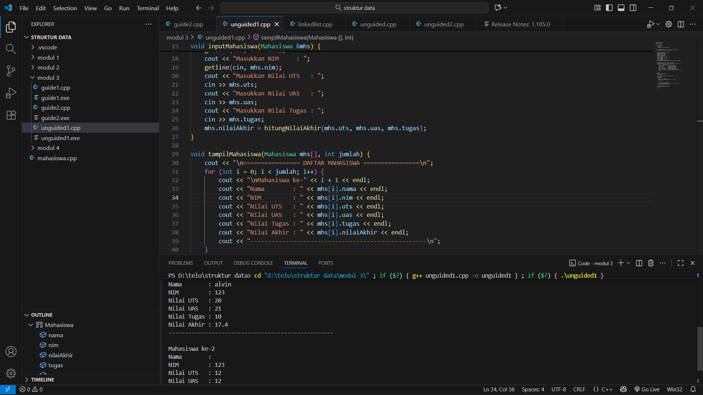
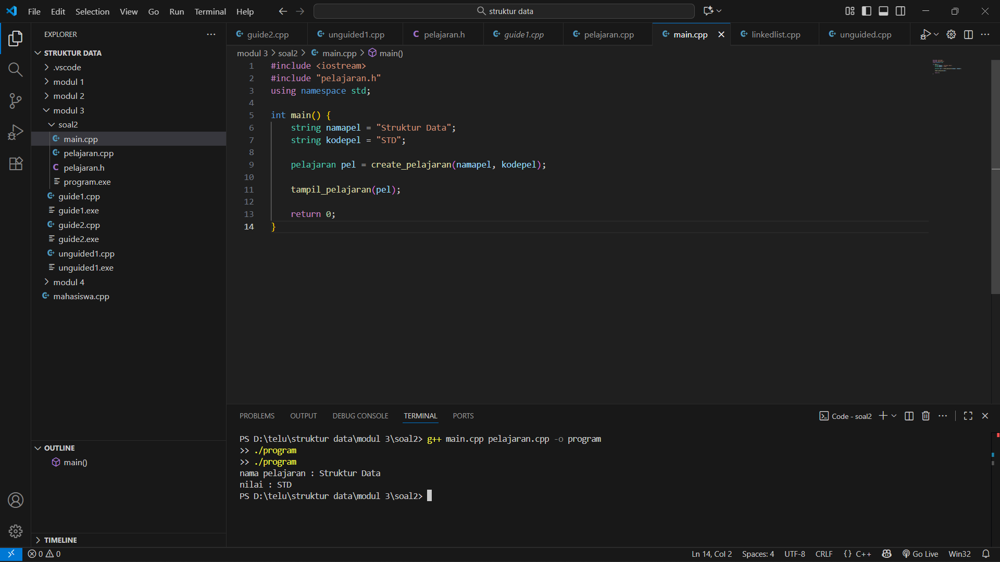
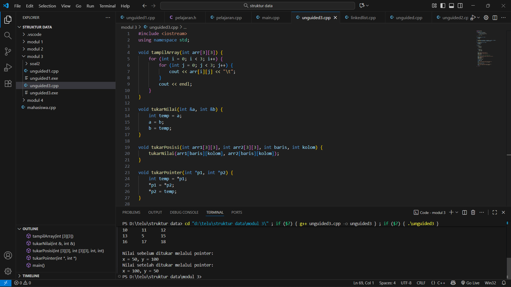

# <h1 align="center">Laporan Praktikum Modul 3 <br> Abstract Data Type</h1>
<p align="center">ULIL FAHMI NURWIDYA - 103112430178</p>

## Dasar Teori
Abstract Data Type (ADT) merupakan konsep dasar dalam pemrograman terstruktur yang digunakan untuk mendefinisikan tipe data baru beserta operasi-operasi dasar (primitif) yang dapat dilakukan terhadapnya. ADT bersifat abstrak karena pengguna hanya mengetahui apa yang dapat dilakukan tanpa perlu memahami bagaimana cara kerjanya secara internal. Dalam ADT biasanya terdapat konstruktor untuk membentuk objek, selector untuk mengakses nilai, mutator untuk mengubah nilai, validator untuk memeriksa keabsahan data, destruktor untuk menghapus objek, serta operator relasional, aritmatika, dan fungsi input/output sebagai antarmuka. Implementasi ADT umumnya dibagi menjadi dua bagian, yaitu file header (.h) yang berisi definisi tipe data dan deklarasi fungsi, serta file implementasi (.cpp) yang berisi realisasi fungsi tersebut. Dengan memisahkan spesifikasi dan implementasi, ADT dapat meningkatkan modularitas, reusabilitas, serta memudahkan pemeliharaan kode program.

## Guided

1. mahasiswa.h
```C++
#ifndef MAHASISWA_H_INCLUDED
#define MAHASISWA_H_INCLUDED

struct mahasiswa
{
    char nim[10];
    int nilai1, nilai2;
};

void inputMhs(mahasiswa &m);
float rata2(mahasiswa m);

#endif
```

2. Mahasiswa.cpp
```C++
#include "mahasiswa.h"
#include <iostream>
using namespace std;

void inputMhs(mahasiswa &m)
{
    cout << "input nama = ";
    cin >> (m) .nim;
    cout << "input nilai = ";
    cin >> (m) .nilai1;
    cout << "input niali2 = ";
    cin >> m .nilai2;

}
float rata2(mahasiswa m)
{
    return float(m.nilai1 + m.nilai2) / 2;
}
```

3. main.cpp
```C++
#include <iostream>
#include "mahasiswa.h"
using namespace std;

int main(){
    mahasiswa mhs;
    inputMhs(mhs);
    cout << "rata rata = " << rata2(mhs);
    return 0;
}
```

## Unguided

### Soal 1
```c++
#include <iostream>
#include <string>
using namespace std;

struct Mahasiswa {
    string nama;
    string nim;
    float uts, uas, tugas, nilaiAkhir;
};

float hitungNilaiAkhir(float uts, float uas, float tugas) {
    return uts * 0.3 + uas * 0.4 + tugas * 0.3;
}

void inputMahasiswa(Mahasiswa &mhs) {
    cout << "Masukkan Nama    : ";
    getline(cin, mhs.nama);
    cout << "Masukkan NIM     : ";
    getline(cin, mhs.nim);
    cout << "Masukkan Nilai UTS   : ";
    cin >> mhs.uts;
    cout << "Masukkan Nilai UAS   : ";
    cin >> mhs.uas;
    cout << "Masukkan Nilai Tugas : ";
    cin >> mhs.tugas;
    mhs.nilaiAkhir = hitungNilaiAkhir(mhs.uts, mhs.uas, mhs.tugas);
}

void tampilMahasiswa(Mahasiswa mhs[], int jumlah) {
    cout << "\n================ DAFTAR MAHASISWA ================\n";
    for (int i = 0; i < jumlah; i++) {
        cout << "\nMahasiswa ke-" << i + 1 << endl;
        cout << "Nama        : " << mhs[i].nama << endl;
        cout << "NIM         : " << mhs[i].nim << endl;
        cout << "Nilai UTS   : " << mhs[i].uts << endl;
        cout << "Nilai UAS   : " << mhs[i].uas << endl;
        cout << "Nilai Tugas : " << mhs[i].tugas << endl;
        cout << "Nilai Akhir : " << mhs[i].nilaiAkhir << endl;
        cout << "--------------------------------------------------\n";
    }
}

int main() {
    Mahasiswa daftarMhs[10];
    int jumlah;

    cout << "Masukkan jumlah mahasiswa (max 10): ";
    cin >> jumlah;
    cin.ignore();

    if (jumlah < 1 || jumlah > 10) {
        cout << "Jumlah mahasiswa tidak valid!" << endl;
        return 0;
    }

    for (int i = 0; i < jumlah; i++) {
        cout << "\nInput data mahasiswa ke-" << i + 1 << endl;
        inputMahasiswa(daftarMhs[i]);
    }

    tampilMahasiswa(daftarMhs, jumlah);

    return 0;
}

```

> Output
> 

Program C++ ini menyimpan dan menampilkan data mahasiswa (maksimal 10 orang) menggunakan struct Mahasiswa, yang berisi nama, nim, uts, uas, tugas, dan nilaiAkhir. Fungsi hitungNilaiAkhir() menghitung nilai akhir berdasarkan rumus 0.3*UTS + 0.4*UAS + 0.3*Tugas. Prosedur inputMahasiswa() digunakan untuk memasukkan data dan menghitung nilai akhir, sedangkan tampilMahasiswa() menampilkan seluruh data mahasiswa. Di main(), pengguna memasukkan jumlah mahasiswa, input data dilakukan satu per satu, dan hasil ditampilkan di akhir program

### Soal 2
### pelajaran.h
```c++
#ifndef PELAJARAN_H_INCLUDED
#define PELAJARAN_H_INCLUDED

#include <string>
using namespace std;

struct pelajaran {
    string namaMapel;
    string kodeMapel;
};

pelajaran create_pelajaran(string namapel, string kodepel);

void tampil_pelajaran(pelajaran pel);

#endif
```
### pelajaran.cpp
```c++
#include <iostream>
#include "pelajaran.h"
using namespace std;

pelajaran create_pelajaran(string namapel, string kodepel) {
    pelajaran p;
    p.namaMapel = namapel;
    p.kodeMapel = kodepel;
    return p;
}

void tampil_pelajaran(pelajaran pel) {
    cout << "nama pelajaran : " << pel.namaMapel << endl;
    cout << "nilai : " << pel.kodeMapel << endl;
}
```
### main.cpp
```c++
#include <iostream>
#include "pelajaran.h"
using namespace std;

int main() {
    string namapel = "Struktur Data";
    string kodepel = "STD";

    pelajaran pel = create_pelajaran(namapel, kodepel);

    tampil_pelajaran(pel);

    return 0;
}
```

> Output
> 

Program tersebut menunjukkan penerapan Abstract Data Type (ADT) dalam C++. ADT yang dibuat bernama pelajaran, dengan atribut namaMapel (nama mata pelajaran) dan kodeMapel (kode mata pelajaran). File pelajaran.h berisi definisi tipe data dan deklarasi fungsi, pelajaran.cpp berisi implementasi fungsi untuk membuat objek (create_pelajaran) dan menampilkannya (tampil_pelajaran), sedangkan main.cpp berfungsi sebagai program utama yang membuat objek pelajaran dengan nama “Struktur Data” dan kode “STD”, lalu menampilkannya ke layar.

### Soal 3
```go
#include <iostream>
using namespace std;

void tampilArray(int arr[3][3]) {
    for (int i = 0; i < 3; i++) {
        for (int j = 0; j < 3; j++) {
            cout << arr[i][j] << "\t";
        }
        cout << endl;
    }
}

void tukarNilai(int &a, int &b) {
    int temp = a;
    a = b;
    b = temp;
}

void tukarPosisi(int arr1[3][3], int arr2[3][3], int baris, int kolom) {
    tukarNilai(arr1[baris][kolom], arr2[baris][kolom]);
}

void tukarPointer(int *p1, int *p2) {
    int temp = *p1;
    *p1 = *p2;
    *p2 = temp;
}

int main() {
    int A[3][3] = {
        {1, 2, 3},
        {4, 5, 6},
        {7, 8, 9}
    };

    int B[3][3] = {
        {10, 11, 12},
        {13, 14, 15},
        {16, 17, 18}
    };

    cout << "Array A sebelum ditukar:\n";
    tampilArray(A);
    cout << "\nArray B sebelum ditukar:\n";
    tampilArray(B);

    tukarPosisi(A, B, 1, 1); // Tukar elemen [1][1]

    cout << "\nArray setelah menukar elemen posisi [1][1]:\n";
    cout << "Array A:\n";
    tampilArray(A);
    cout << "\nArray B:\n";
    tampilArray(B);

    int x = 50, y = 100;
    int *ptrX = &x;
    int *ptrY = &y;

    cout << "\nNilai sebelum ditukar melalui pointer:\n";
    cout << "x = " << x << ", y = " << y << endl;

    tukarPointer(ptrX, ptrY);

    cout << "Nilai setelah ditukar melalui pointer:\n";
    cout << "x = " << x << ", y = " << y << endl;

    return 0;
}
```

> Output
> )

Program ini digunakan untuk menampilkan dan menukar nilai pada array 2 dimensi serta menukar nilai variabel melalui pointer. Terdapat dua array 3x3, A dan B. Fungsi tampilArray() menampilkan isi array, tukarPosisi() menukar elemen pada posisi tertentu antara dua array, dan tukarPointer() menukar nilai dua variabel melalui pointer. Di main(), program menampilkan kedua array sebelum dan sesudah menukar elemen [1][1], serta menukar nilai variabel x dan y. Program ini memperlihatkan penggunaan fungsi, array 2D, reference, dan pointer di C++.

## Referensi
